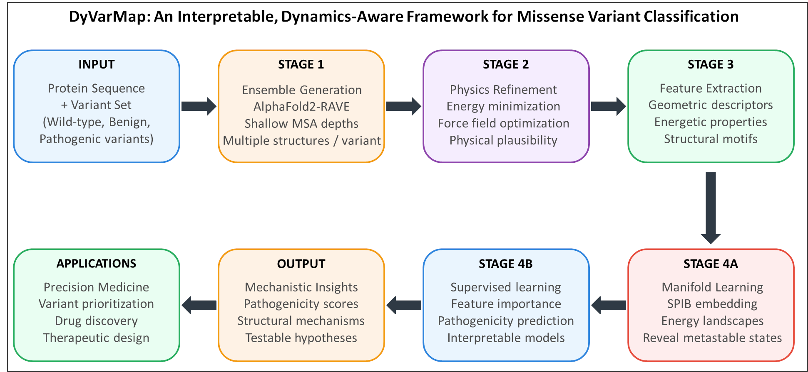
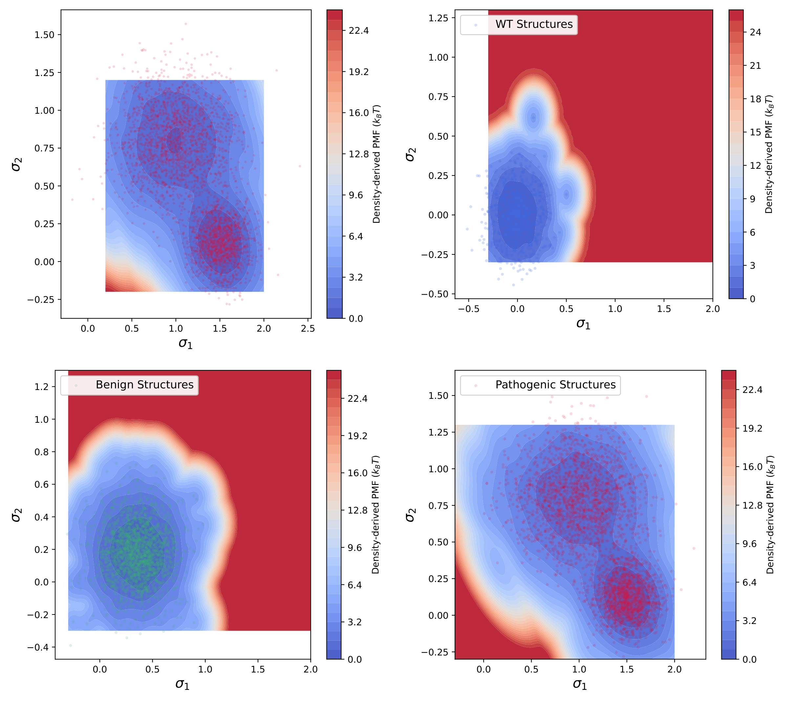
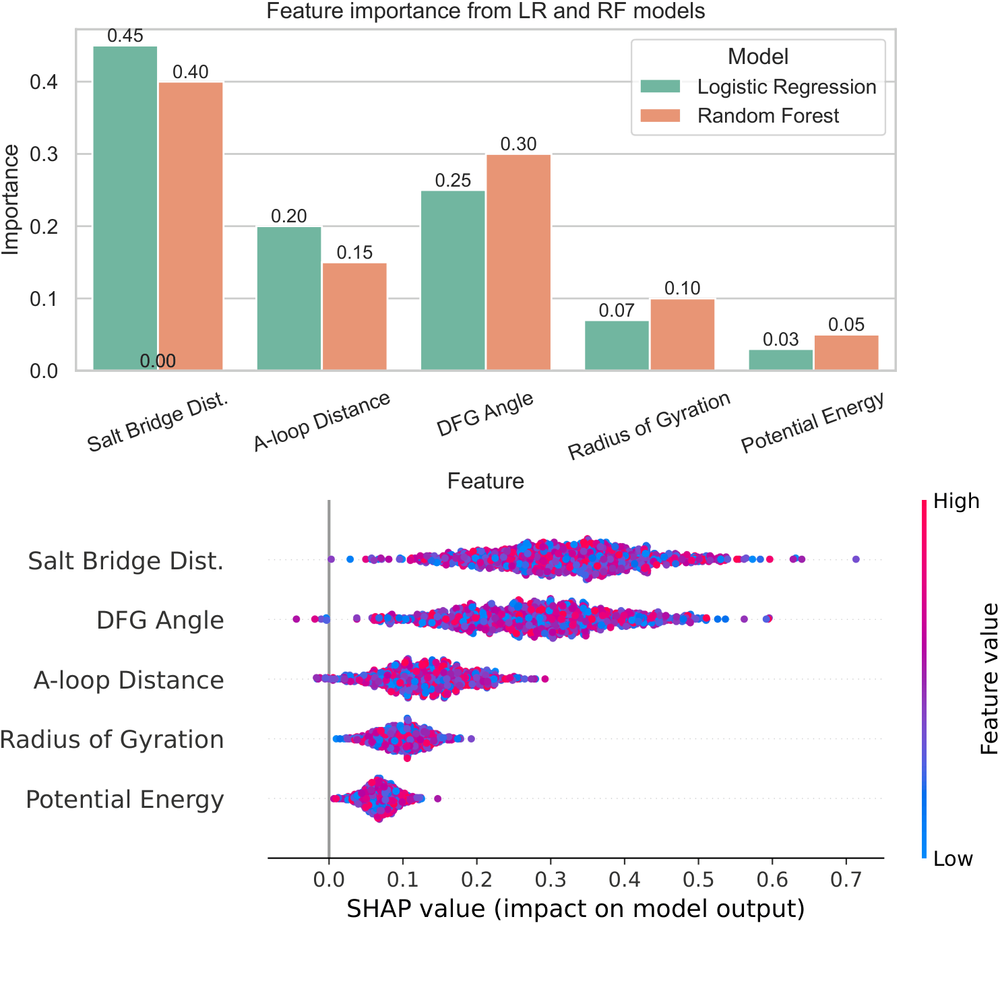

# DyVarMap: Dynamic Variant Mapping 🧬⚙️


**DyVarMap** is an end-to-end, interpretable computational framework that integrates AlphaFold2-based ensemble generation, physics-driven molecular dynamics (MD) refinement, nonlinear manifold learning, and explainable AI. It is designed to decode the biophysical mechanisms underlying cancer-associated missense variants, with a specific focus on complex receptor tyrosine kinases like **FGFR2**.

By mapping high-dimensional structural data onto interpretable free energy landscapes, DyVarMap moves beyond black-box pathogenicity scores (e.g., AlphaMissense) to pinpoint precise biophysical disruptions such as salt-bridge breakages and allosteric shifts.

---

## 🔬 Pipeline Overview

The framework is highly modularized into four distinct engineering and analytical stages:



1. **Stage 1: Conformational Sampling (AF2-RAVE)** Generation of diverse initial structural ensembles across wild-type (WT) and variants using modified AlphaFold2 pipelines.
2. **Stage 2: Physics-Driven Refinement (OpenMM)** Automated energy minimization in a vacuum environment to resolve steric clashes and optimize side-chain geometries.
3. **Stage 3: High-Dimensional Feature Extraction (MDTraj/MDAnalysis)** Extraction of biophysically motivated geometric features: Salt-bridge distances, A-loop lengths, αC-helix angles, and DFG-motif dihedral angles.
4. **Stage 4: Manifold Learning & Explainable ML (SPIB + SHAP)** Nonlinear dimensionality reduction (SPIB) and density-based clustering (HDBSCAN) to identify metastable states, followed by Random Forest/SVM classification with SHAP-based feature attribution.

---

## 🛠️ Installation & Setup

We highly recommend using `conda` to manage the dependencies and ensure reproducibility.

```bash
# Clone the repository
git clone [https://github.com/bearcrossing/DyVarMap.git](https://github.com/bearcrossing/DyVarMap.git)
cd DyVarMap

# Create and activate the conda environment
conda env create -f environment.yml
conda activate dyvarmap
```

---

## 📂 Repository Structure

```text
DyVarMap/
├── assets/                 # Images and figures for documentation
├── data/                   # Example datasets
│   ├── raw_pdbs/           # Sample structures (WT and A628T)
│   └── features/           # Extracted geometric feature matrices
├── dyvarmap/               # Core Python modules
│   ├── stage1_ensemble.py  # AF2 orchestration
│   ├── stage2_refine.py    # OpenMM minimization pipeline
│   ├── stage3_features.py  # Structural feature extraction 
│   └── stage4_ml.py        # SPIB, HDBSCAN, and SHAP classification
├── notebooks/              # Jupyter notebooks for interactive analysis
│   └── 01_pipeline_walkthrough.ipynb
├── scripts/                # Bash scripts for HPC workload scheduling (SLURM/PBS)
├── environment.yml         # Conda environment configuration
└── README.md
```

---

## 📊 Result Highlights

### 1. Distinct Free Energy Landscapes
By employing State Predictive Information Bottleneck (SPIB), DyVarMap successfully projects complex, high-dimensional conformational dynamics into a 2D interpretable space, revealing stark differences in metastable states between WT and pathogenic variants.



### 2. Mechanistic Interpretability via SHAP
Unlike traditional sequence-based models, DyVarMap utilizes SHAP (SHapley Additive exPlanations) to quantify exactly *which* biophysical features drive the pathogenicity prediction (e.g., the disruption of the crucial E565-K659 salt bridge).



---

## 📝 Citation

If you use DyVarMap or find this repository helpful in your research, please cite our paper:

```bibtex
@article{lian2026dyvarmap,
  title={DyVarMap: Integrating Conformational Dynamics and Interpretable Machine Learning for Cancer-Associated Missense Variant Classification in FGFR2},
  author={Lian, Yiyang and Shehu, Amarda},
  journal={Bioengineering},
  volume={13},
  number={x},
  pages={126},
  year={2026},
  publisher={MDPI},
  doi={10.3390/bioengineering1300126}
}
```

## 📬 Contact
**Yiyang Lian** - [yiyang.lian7@gmail.com](mailto:yiyang.lian7@gmail.com)  
Ph.D., Bioinformatics and Computational Biology, George Mason University
